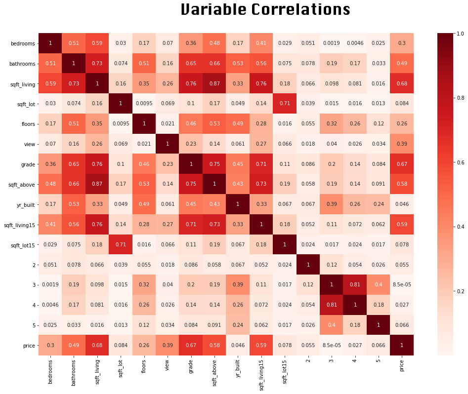
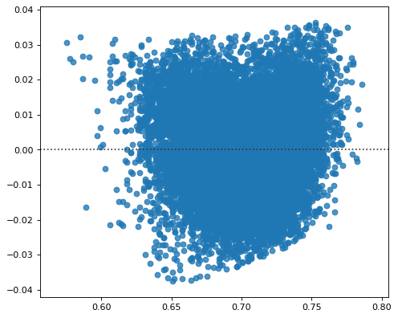
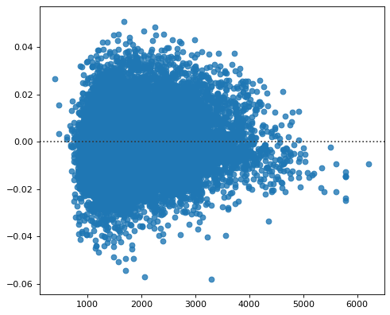
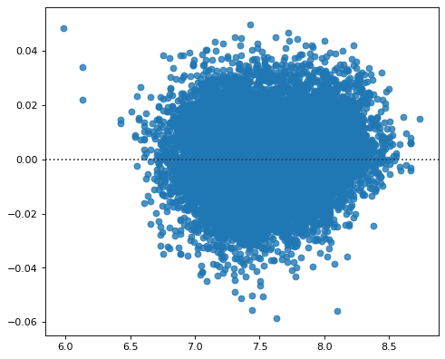
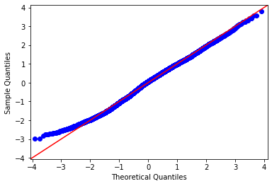
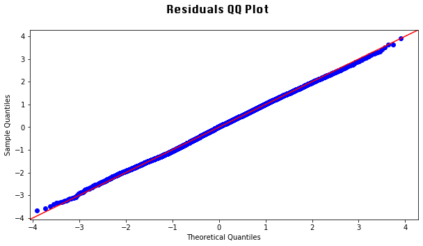
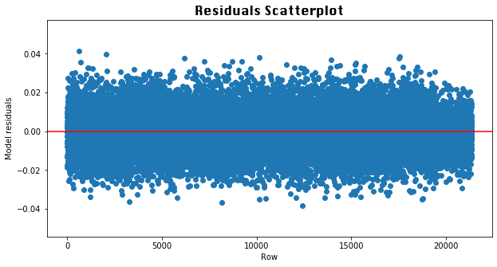

# Predicting House Prices with the King County Housing Data Set

## Final Project Submission

* Student name: Avonlea Fisher 
* Student pace: full time 
* Scheduled project review date/time: Tue, Sep 1, 2020, 04:30 PM - 05:15 PM EST
* Instructor name: James Irving
* Blog post URL: https://medium.com/@avfisher/predicting-king-county-house-prices-with-multiple-linear-regression-84de5feeafb2


## Introduction

The King County Housing Data Set contains information about the size, location, condition, and other features of houses in Kings County. A full description of the dataset's columns can be found below. The aim of this project is to develop a model than can predict a house's price as accurately as possible.

### Column Names and descriptions for King County Data Set
* **id** - unique identified for a house
* **dateDate** - house was sold
* **pricePrice** -  is prediction target
* **bedroomsNumber** -  of Bedrooms/House
* **bathroomsNumber** -  of bathrooms/bedrooms
* **sqft_livingsquare** -  footage of the home
* **sqft_lotsquare** -  footage of the lot
* **floorsTotal** -  floors (levels) in house
* **waterfront** - House which has a view to a waterfront
* **view** - Has been viewed
* **condition** - How good the condition is ( Overall )
* **grade** - overall grade given to the housing unit, based on King County grading system
* **sqft_above** - square footage of house apart from basement
* **sqft_basement** - square footage of the basement
* **yr_built** - Built Year
* **yr_renovated** - Year when house was renovated
* **zipcode** - zip
* **lat** - Latitude coordinate
* **long** - Longitude coordinate
* **sqft_living15** - The square footage of interior housing living space for the nearest 15 neighbors
* **sqft_lot15** - The square footage of the land lots of the nearest 15 neighbors


```python
#load necessary modules 
import numpy as np
import pandas as pd
import matplotlib.pyplot as plt
%matplotlib inline
import scipy.stats as stats
import statsmodels.formula.api as smf
import statsmodels.stats.api as sms
import statsmodels.api as sm
from statsmodels.formula.api import ols
from sklearn import datasets, linear_model
import seaborn as sns
from sklearn import preprocessing
from sklearn.preprocessing import LabelEncoder
from sklearn import metrics
from sklearn.metrics import r2_score
from sklearn.metrics import mean_squared_error, make_scorer
from sklearn.model_selection import cross_val_score
from sklearn.feature_selection import RFE
from sklearn.linear_model import LinearRegression
from sklearn.model_selection import train_test_split
```

    /opt/anaconda3/envs/learn-env/lib/python3.6/site-packages/statsmodels/tools/_testing.py:19: FutureWarning: pandas.util.testing is deprecated. Use the functions in the public API at pandas.testing instead.
      import pandas.util.testing as tm


## Previewing the Data

Let's start by loading and previewing the dataframe.


```python
df = pd.read_csv('kc_house_data.csv')
df.head()
```


<div>
<style scoped>
    .dataframe tbody tr th:only-of-type {
        vertical-align: middle;
    }

    .dataframe tbody tr th {
        vertical-align: top;
    }

    .dataframe thead th {
        text-align: right;
    }
</style>
<table border="1" class="dataframe">
  <thead>
    <tr style="text-align: right;">
      <th></th>
      <th>id</th>
      <th>date</th>
      <th>price</th>
      <th>bedrooms</th>
      <th>bathrooms</th>
      <th>sqft_living</th>
      <th>sqft_lot</th>
      <th>floors</th>
      <th>waterfront</th>
      <th>view</th>
      <th>...</th>
      <th>grade</th>
      <th>sqft_above</th>
      <th>sqft_basement</th>
      <th>yr_built</th>
      <th>yr_renovated</th>
      <th>zipcode</th>
      <th>lat</th>
      <th>long</th>
      <th>sqft_living15</th>
      <th>sqft_lot15</th>
    </tr>
  </thead>
  <tbody>
    <tr>
      <th>0</th>
      <td>7129300520</td>
      <td>10/13/2014</td>
      <td>221900.0</td>
      <td>3</td>
      <td>1.00</td>
      <td>1180</td>
      <td>5650</td>
      <td>1.0</td>
      <td>NaN</td>
      <td>0.0</td>
      <td>...</td>
      <td>7</td>
      <td>1180</td>
      <td>0.0</td>
      <td>1955</td>
      <td>0.0</td>
      <td>98178</td>
      <td>47.5112</td>
      <td>-122.257</td>
      <td>1340</td>
      <td>5650</td>
    </tr>
    <tr>
      <th>1</th>
      <td>6414100192</td>
      <td>12/9/2014</td>
      <td>538000.0</td>
      <td>3</td>
      <td>2.25</td>
      <td>2570</td>
      <td>7242</td>
      <td>2.0</td>
      <td>0.0</td>
      <td>0.0</td>
      <td>...</td>
      <td>7</td>
      <td>2170</td>
      <td>400.0</td>
      <td>1951</td>
      <td>1991.0</td>
      <td>98125</td>
      <td>47.7210</td>
      <td>-122.319</td>
      <td>1690</td>
      <td>7639</td>
    </tr>
    <tr>
      <th>2</th>
      <td>5631500400</td>
      <td>2/25/2015</td>
      <td>180000.0</td>
      <td>2</td>
      <td>1.00</td>
      <td>770</td>
      <td>10000</td>
      <td>1.0</td>
      <td>0.0</td>
      <td>0.0</td>
      <td>...</td>
      <td>6</td>
      <td>770</td>
      <td>0.0</td>
      <td>1933</td>
      <td>NaN</td>
      <td>98028</td>
      <td>47.7379</td>
      <td>-122.233</td>
      <td>2720</td>
      <td>8062</td>
    </tr>
    <tr>
      <th>3</th>
      <td>2487200875</td>
      <td>12/9/2014</td>
      <td>604000.0</td>
      <td>4</td>
      <td>3.00</td>
      <td>1960</td>
      <td>5000</td>
      <td>1.0</td>
      <td>0.0</td>
      <td>0.0</td>
      <td>...</td>
      <td>7</td>
      <td>1050</td>
      <td>910.0</td>
      <td>1965</td>
      <td>0.0</td>
      <td>98136</td>
      <td>47.5208</td>
      <td>-122.393</td>
      <td>1360</td>
      <td>5000</td>
    </tr>
    <tr>
      <th>4</th>
      <td>1954400510</td>
      <td>2/18/2015</td>
      <td>510000.0</td>
      <td>3</td>
      <td>2.00</td>
      <td>1680</td>
      <td>8080</td>
      <td>1.0</td>
      <td>0.0</td>
      <td>0.0</td>
      <td>...</td>
      <td>8</td>
      <td>1680</td>
      <td>0.0</td>
      <td>1987</td>
      <td>0.0</td>
      <td>98074</td>
      <td>47.6168</td>
      <td>-122.045</td>
      <td>1800</td>
      <td>7503</td>
    </tr>
  </tbody>
</table>
<p>5 rows × 21 columns</p>
</div>


Now let's check the datatypes and shape.


```python
df.info()
```

    <class 'pandas.core.frame.DataFrame'>
    RangeIndex: 21597 entries, 0 to 21596
    Data columns (total 21 columns):
     #   Column         Non-Null Count  Dtype  
    ---  ------         --------------  -----  
     0   id             21597 non-null  int64  
     1   date           21597 non-null  object 
     2   price          21597 non-null  float64
     3   bedrooms       21597 non-null  int64  
     4   bathrooms      21597 non-null  float64
     5   sqft_living    21597 non-null  int64  
     6   sqft_lot       21597 non-null  int64  
     7   floors         21597 non-null  float64
     8   waterfront     19221 non-null  float64
     9   view           21534 non-null  float64
     10  condition      21597 non-null  int64  
     11  grade          21597 non-null  int64  
     12  sqft_above     21597 non-null  int64  
     13  sqft_basement  21597 non-null  object 
     14  yr_built       21597 non-null  int64  
     15  yr_renovated   17755 non-null  float64
     16  zipcode        21597 non-null  int64  
     17  lat            21597 non-null  float64
     18  long           21597 non-null  float64
     19  sqft_living15  21597 non-null  int64  
     20  sqft_lot15     21597 non-null  int64  
    dtypes: float64(8), int64(11), object(2)
    memory usage: 3.5+ MB


We can see that it’s a large dataset, containing more than 21 thousand entries and 20 columns. Almost all of the columns contain numeric data, which is convenient for linear regression.

Let's look at the distribution of variables in the dataset:


```python
df.hist(figsize=(20,20));
```


Many of the variables do not follow a normal distribution, and the scales are dramatically different for some variables. This may create issues with satisfying all regression assumptions, but we'll address those issues as they arise. Regression does not require features to be normally distributed.

## Preprocessing 

### Dealing with Missing Values

Let's look at the proportions of missing values in each of the columns.


```python
for column in df.columns:
    proportion_of_nas = (sum(df[column].isnull())/len(df[column])) * 100 
    print(column, proportion_of_nas)
```

    id 0.0
    date 0.0
    price 0.0
    bedrooms 0.0
    bathrooms 0.0
    sqft_living 0.0
    sqft_lot 0.0
    floors 0.0
    waterfront 11.00152798999861
    view 0.29170718155299347
    condition 0.0
    grade 0.0
    sqft_above 0.0
    sqft_basement 0.0
    yr_built 0.0
    yr_renovated 17.78950780200954
    zipcode 0.0
    lat 0.0
    long 0.0
    sqft_living15 0.0
    sqft_lot15 0.0


The waterfront, view, and yr_renovated variables all have missing values. Let's inspect the value counts for each of these columns.


```python
df['waterfront'].value_counts()
```


    0.0    19075
    1.0      146
    Name: waterfront, dtype: int64


```python
df['view'].value_counts()
```


    0.0    19422
    2.0      957
    3.0      508
    1.0      330
    4.0      317
    Name: view, dtype: int64


```python
df['yr_renovated'].value_counts()
```


    0.0       17011
    2014.0       73
    2003.0       31
    2013.0       31
    2007.0       30
              ...  
    1946.0        1
    1959.0        1
    1971.0        1
    1951.0        1
    1954.0        1
    Name: yr_renovated, Length: 70, dtype: int64


Given that the majority of homes in the data do not have a renovation date (indicated by '0'), and that nearly 18% of the rows contain missing values, we can drop this columns entirely without losing too much useful data. The view column contains only 63 missing values, which can be filled with the median to avoid losing additional data.


```python
df.drop('yr_renovated', axis=1, inplace=True)
```


```python
df['waterfront'].fillna(0, inplace=True)
```


```python
df['view'].fillna(np.mean(df['view']), inplace=True)
```

Let's check the missing value counts again to confirm that none remain in the data.


```python
for column in list(df.columns):
    print(column, sum(df[column].isnull()))
```

    id 0
    date 0
    price 0
    bedrooms 0
    bathrooms 0
    sqft_living 0
    sqft_lot 0
    floors 0
    waterfront 0
    view 0
    condition 0
    grade 0
    sqft_above 0
    sqft_basement 0
    yr_built 0
    zipcode 0
    lat 0
    long 0
    sqft_living15 0
    sqft_lot15 0


### Dealing with Outliers

Outliers should be kept if they have the potential to reveal useful information about relationships in our data. There are two variables in this dataset, however, whose outliers should be removed: bedrooms and bathrooms. If a residence in the dataset has, for example, more than 5 bathrooms or more than 10 bedrooms, we're likely not dealing with single-family homes, but much larger units that would be better to analyze separately. For this reason, we'll remove all rows in the data that contain outlier values for these columns.


```python
count = 0
bath_outliers = []
mean = np.mean(df['bathrooms'])
max_distance = np.std(df['bathrooms']) * 3 

for idx, row in df['bathrooms'].T.iteritems():
    if abs(row-mean) >= max_distance:
        count += 1
        df.drop(idx, inplace=True)
count
```


    187


```python
count = 0
bed_outliers = []
mean = np.mean(df['bedrooms'])
max_distance = np.std(df['bedrooms']) * 3 

for idx, row in df['bedrooms'].T.iteritems():
    if abs(row-mean) >= max_distance:
        count += 1
        df.drop(idx,inplace=True)
count
```


    47


There were 47 remaining bedroom outliers after we dropped the 187 bathroom outliers. Getting rid of these outliers likely also excluded rows with extreme values for other variables.

### One-Hot Encoding 

There's one variable in the dataset that we would expect to be highly related with price, but which doesn't have a clear linear relationship: condition. The values for this column are coded on a 1-5 linear scale, with 1 being 'poor' and 5 being 'very good.' Interestingly, the below scatterplot shows that 'average' houses tend to perform the best in terms of price.


```python
plt.figure(figsize=(10,7))
sns.scatterplot(df['condition'], df['price'])
plt.title('House Condition and Price', fontsize=15, fontname='silom')
```


    Text(0.5, 1.0, 'House Condition and Price')


This may be due to the fact that the condition values are relative to age and grade (which refers to the design/quality of construction rather than the utility/functionality of the building). A new, excellently designed, very expensive building could be given an 'average' condition rating if some functional repairs are needed. As we can see in the scatterplot below, average condition houses also tend to have the highest grade rating.


```python
plt.figure(figsize=(10,7))
sns.scatterplot(df['condition'], df['grade'])
plt.title('House Condition and Grade', fontsize=15, fontname='silom')
```


    Text(0.5, 1.0, 'House Condition and Grade')


There might be a clearer linear relationship between price and specific condition values, which we can explore more effectively by one-hot encoding the variable. The below code creates a dummy variable for each condition value, drops the first value to avoid the dummy variable trap, drops the original column, and joins the new variables to the dataframe.


```python
one_hot = pd.get_dummies(df['condition'], drop_first=True) #drop a column to avoid dummy variable trap
df = df.drop('condition',axis = 1)
df = df.join(one_hot)
```

Now if we generate scatter plots the condition values, we can see a clearer linear relationship.


```python
price = df['price']
two = df['two'] = df[2] 
three = df['three'] = df[3] 
four = df['four'] = df[4] 
five = df['five'] = df[5] 

f = plt.figure()
f, axes = plt.subplots(nrows = 2, ncols = 2, sharex=False, sharey = True, figsize=(10,5))

f.suptitle('House Condition and Price', fontsize=18, y=1.1, fontname='Silom')
f.text(0.0001, 0.56, 'Prices', va='center', rotation='vertical', fontsize=16, fontname='Silom')

sc = axes[0][0].scatter(two, price, c = price, marker = "*")
axes[0][0].set_xlabel('Condition 2')

axes[0][1].scatter(three, price, c = price, marker = "*")
axes[0][1].set_xlabel('Condition 3')

axes[1][0].scatter(four, price, c = price, marker = "*")
axes[1][0].set_xlabel('Condition 4')

axes[1][1].scatter(five, price, c = price, marker = "*")
axes[1][1].set_xlabel('Condition 5')


f.tight_layout()
plt.show()
```


    <Figure size 432x288 with 0 Axes>





Now there are linear relationships for each column, with condition ratings 2 and three having the most pronounced relationships.

### Checking Correlations and Multicollinearity

We're interested in finding out which variables are most strongly correlated with price, as these variables will be good candidates for inclusion in our model. One of the assumptions of a multiple linear regression model, however, is that there is no multicollinearity among the explanatory variables (i.e., they can't be predicted by other explanatory variables with high accuracy). Below, we create a correlation matrix of price and continuous variables in the dataset to visualize correlations.


```python
#create a list of meaningfully continuous x variables
x_columns = ['bedrooms', 'bathrooms', 'sqft_living',
       'sqft_lot', 'floors', 'view', 'grade',
       'sqft_above', 'yr_built', 'sqft_living15', 'sqft_lot15', 2, 3, 4, 5]

#update dataframe to only include the above variables
df_clean = df[x_columns]
df_clean['price'] = df['price']
df = df_clean
```

    /opt/anaconda3/envs/learn-env/lib/python3.6/site-packages/ipykernel_launcher.py:8: SettingWithCopyWarning: 
    A value is trying to be set on a copy of a slice from a DataFrame.
    Try using .loc[row_indexer,col_indexer] = value instead
    
    See the caveats in the documentation: https://pandas.pydata.org/pandas-docs/stable/user_guide/indexing.html#returning-a-view-versus-a-copy
      


```python
corr = df.corr().abs()
fig, ax=plt.subplots(figsize=(17,12))
fig.suptitle('Variable Correlations', fontsize=30, y=.95, fontname='Silom')
heatmap = sns.heatmap(corr, cmap='Reds', annot=True)
heatmap
```


    <matplotlib.axes._subplots.AxesSubplot at 0x1c1ae406d8>


As we might expect, many of the variables related to the size of homes (e.g. sqft, number of rooms) are highly correlated with each other. Generally, we don’t want to include any two x variables whose correlation exceeds .80 in the same model. We do, however, want to include variables that are correlated with the y variable. The code below creates and displays two small dataframes that narrow down the correlations we’re most interested in.


```python
features = []
correlations = []
for idx, correlation in corr['price'].T.iteritems():
    if correlation >= .30 and idx != 'price':
        features.append(idx)
        correlations.append(correlation)
corr_price_df = pd.DataFrame({'Correlations':correlations, 'Features': features})
```


```python
Multicollinear_Features = []
Multicollinear_Corr = []
def check_multicollinearity(feature):
    for idx, correlation in corr[feature].T.iteritems():
        if correlation >= .80 and idx != feature:
            Multicollinear_Features.append([feature, idx])
            Multicollinear_Corr.append(correlation)
            
for feature in corr:
    check_multicollinearity(feature)
MC_df = pd.DataFrame({'Correlations':Multicollinear_Corr, 'Features': Multicollinear_Features})
```


```python
print('Multicollinear Features')
display(MC_df)
print('Correlations with Price')
display(corr_price_df)
```

    Multicollinear Features


<div>
<style scoped>
    .dataframe tbody tr th:only-of-type {
        vertical-align: middle;
    }

    .dataframe tbody tr th {
        vertical-align: top;
    }

    .dataframe thead th {
        text-align: right;
    }
</style>
<table border="1" class="dataframe">
  <thead>
    <tr style="text-align: right;">
      <th></th>
      <th>Correlations</th>
      <th>Features</th>
    </tr>
  </thead>
  <tbody>
    <tr>
      <th>0</th>
      <td>0.866887</td>
      <td>[sqft_living, sqft_above]</td>
    </tr>
    <tr>
      <th>1</th>
      <td>0.866887</td>
      <td>[sqft_above, sqft_living]</td>
    </tr>
    <tr>
      <th>2</th>
      <td>0.812117</td>
      <td>[3, 4]</td>
    </tr>
    <tr>
      <th>3</th>
      <td>0.812117</td>
      <td>[4, 3]</td>
    </tr>
  </tbody>
</table>
</div>


    Correlations with Price


<div>
<style scoped>
    .dataframe tbody tr th:only-of-type {
        vertical-align: middle;
    }

    .dataframe tbody tr th {
        vertical-align: top;
    }

    .dataframe thead th {
        text-align: right;
    }
</style>
<table border="1" class="dataframe">
  <thead>
    <tr style="text-align: right;">
      <th></th>
      <th>Correlations</th>
      <th>Features</th>
    </tr>
  </thead>
  <tbody>
    <tr>
      <th>0</th>
      <td>0.302105</td>
      <td>bedrooms</td>
    </tr>
    <tr>
      <th>1</th>
      <td>0.489138</td>
      <td>bathrooms</td>
    </tr>
    <tr>
      <th>2</th>
      <td>0.677596</td>
      <td>sqft_living</td>
    </tr>
    <tr>
      <th>3</th>
      <td>0.386794</td>
      <td>view</td>
    </tr>
    <tr>
      <th>4</th>
      <td>0.668335</td>
      <td>grade</td>
    </tr>
    <tr>
      <th>5</th>
      <td>0.578363</td>
      <td>sqft_above</td>
    </tr>
    <tr>
      <th>6</th>
      <td>0.593674</td>
      <td>sqft_living15</td>
    </tr>
  </tbody>
</table>
</div>


Although sqft_living and sqft_above are both highly correlated with price, only one of them can be included in a multiple regression model because they are also highly correlated with each other. Fortunately, the other two variables whose correlation violates this assumption have a relatively weak correlation with price. Below, we create objects for the variables that are strong candidates for inclusion in the model. 


```python
price = df['price']
bath = df['bathrooms']
bed = df['bedrooms']
grade = df['grade']
sqft_living15 = df['sqft_living15']
floors = df['floors']
view = df['view']
sqft_living = df['sqft_living']
sqft_above = df['sqft_above']
```

We'll now make some scatterplots to visually explore the relationship between these variables and price. Linear regression analysis also assumes that the relationship between explanatory and response variables is linear.


```python
f = plt.figure()
f, axes = plt.subplots(nrows = 2, ncols = 4, sharex=False, sharey = True, figsize=(17,12))

f.suptitle('Correlates of King County House Prices', fontsize=30, y=1.1, fontname='Silom')
f.text(0.0001, 0.56, 'Prices', va='center', rotation='vertical', fontsize=16, fontname='Silom')

sc = axes[0][0].scatter(bath, price, c = price, marker = "x")
axes[0][0].set_xlabel('Bathrooms')

axes[0][1].scatter(bed, price, c = price, marker = "x")
axes[0][1].set_xlabel('Bedrooms')

axes[1][0].scatter(grade, price, c = price, marker = "x")
axes[1][0].set_xlabel('Grade')

axes[1][1].scatter(sqft_living15, price, c = price, marker = "x")
axes[1][1].set_xlabel('Sqft Living of Nearest 15 Neighbors')

axes[0][2].scatter(floors, price, c = price, marker = "x")
axes[0][2].set_xlabel('Floors')

axes[1][2].scatter(view, price, c = price, marker = "x")
axes[1][2].set_xlabel('View')

sc = axes[0][3].scatter(sqft_living, price, c = price, marker = "x")
axes[0][3].set_xlabel('Sqft Living')

sc = axes[1][3].scatter(sqft_above, price, c = price, marker = "x")
axes[1][3].set_xlabel('Sqft Above')

cbar_ax = f.add_axes([1, 0.22, 0.05, 0.7])

f.colorbar(sc, cax=cbar_ax)

f.tight_layout()
plt.show()

```

    /opt/anaconda3/envs/learn-env/lib/python3.6/site-packages/ipykernel_launcher.py:35: UserWarning: This figure includes Axes that are not compatible with tight_layout, so results might be incorrect.


    <Figure size 432x288 with 0 Axes>


The 'view', 'floors', and 'bedrooms' variables do not have a clear linear relationship with house price. Sqft living has a stronger linear relationship with price than sqft above, so it will be used in the multiple regression model. Due to its multicollinearity with sqft above, sqft above will be excluded.

# Simple Linear Regression

There are 3 assumptions about the data that must be checked before building any simple linear regression model:
- There should be a linear relationship between the explanatory and response variables (already checked).
- The data should be homoscedastic (i.e., the residuals have equal variance around the regression line on a scatterplot).
- The model residuals should follow a normal distribution (i.e. the residuals fall along a relatively straight line on a QQ plot).

All of the above assumptions, in addition to the assumption of no multicollinearity, also apply to multiple regression. 

In addition to checking for these assumptions, we're also look at two values in the model summary:
- <b>R-squared:</b> This value tells us what proportion of the variability of y around its mean can be explained by the model. It can fall between 0 and 1, and a higher r-squared value indicates higher predictive power.
- <b>p-value:</b> The null hypothesis for linear regression is that there is no relationship between the chosen explanatory variables and the response variable. Therefore, we want the model to have a p-value lower than .05 so we can reject the null hypothesis.

A simple linear regression model includes only one explanatory variable and one response variable. We'll create a simple linear regression model for each of the chosen explanatory variables that satisfy linearity, and test the assumptions for each. These variables are sqft_living, sqft_living15, bathrooms and grade. 

## 1. Sqft living


```python
f = 'price~sqft_living'
sqft_living_model = smf.ols(formula=f, data=df).fit()
print('R Squared:', sqft_living_model.rsquared)
print('p-value:', sqft_living_model.f_pvalue)
```

    R Squared: 0.4591368052754867
    p-value: 0.0


```python
plt.figure(figsize=(7, 6), dpi=80)
x = np.array(df['sqft_living'])
y = np.array(df['price'])

sns.residplot(x, y)
```


    <matplotlib.axes._subplots.AxesSubplot at 0x1c1a5da1d0>


<b>Homoscedasticity:</b> Heteroscedastic 


```python
residuals = sqft_living_model.resid
fig = sm.graphics.qqplot(residuals, dist=stats.norm, line='45', fit=True)
fig.show()
```

    /opt/anaconda3/envs/learn-env/lib/python3.6/site-packages/ipykernel_launcher.py:3: UserWarning: Matplotlib is currently using module://ipykernel.pylab.backend_inline, which is a non-GUI backend, so cannot show the figure.
      This is separate from the ipykernel package so we can avoid doing imports until





<b>Normality of residuals:</b> Not normal.

As we can see, this model violates the homoscedasticity and normality assumptions for linear regression. Log-transformation can often help when these assumptions are not met. Let's update the values to their natural logs and re-check the assumptions.


```python
df['price'] = np.log(df['price'])
df['sqft_living'] = np.log(df['sqft_living'])
```


```python
f = 'price~sqft_living'
sqft_living_model = smf.ols(formula=f, data=df).fit()
print('R Squared:', sqft_living_model.rsquared)
print('p-value:', sqft_living_model.f_pvalue)
```

    R Squared: 0.4373420079657424
    p-value: 0.0


```python
plt.figure(figsize=(7, 6), dpi=80)
x = np.array(df['sqft_living'])
y = np.array(df['price'])

sns.residplot(x, y)
```


    <matplotlib.axes._subplots.AxesSubplot at 0x1c1b6f4668>





```python
residuals = sqft_living_model.resid
fig = sm.graphics.qqplot(residuals, dist=stats.norm, line='45', fit=True)
fig.show()
```

    /opt/anaconda3/envs/learn-env/lib/python3.6/site-packages/ipykernel_launcher.py:3: UserWarning: Matplotlib is currently using module://ipykernel.pylab.backend_inline, which is a non-GUI backend, so cannot show the figure.
      This is separate from the ipykernel package so we can avoid doing imports until


Much better! Now all assumptions for this model are satisfied.

## 2. Sqft Living of Nearest 15 Neighbors


```python
f = 'price~sqft_living15'
sqft15_model = smf.ols(formula=f, data=df).fit()
print('R Squared:', sqft15_model.rsquared)
print('p-value:', sqft15_model.f_pvalue)
```

    R Squared: 0.372162662009224
    p-value: 0.0


```python
plt.figure(figsize=(7, 6), dpi=80)
x = np.array(df['sqft_living15'])
y = np.array(df['price'])

sns.residplot(x, y)
```


    <matplotlib.axes._subplots.AxesSubplot at 0x1c1af0f9e8>


<b>Homoscedasticity:</b> Heteroscedastic


```python
residuals = sqft15_model.resid
fig = sm.graphics.qqplot(residuals, dist=stats.norm, line='45', fit=True)
fig.show()
```

    /opt/anaconda3/envs/learn-env/lib/python3.6/site-packages/ipykernel_launcher.py:3: UserWarning: Matplotlib is currently using module://ipykernel.pylab.backend_inline, which is a non-GUI backend, so cannot show the figure.
      This is separate from the ipykernel package so we can avoid doing imports until





<b>Normality of residuals:</b> Normal.

The homoscedasticity assumption is violated. We'll log-transform the sqft_living15 variable, as we did with the previous variable, to address this. 


```python
df['sqft_living15'] = np.log(df['sqft_living15'])
```


```python
f = 'price~sqft_living'
sqft_living_model = smf.ols(formula=f, data=df).fit()
print('R Squared:', sqft15_model.rsquared)
print('p-value:', sqft15_model.f_pvalue)
```

    R Squared: 0.372162662009224
    p-value: 0.0


```python
plt.figure(figsize=(7, 6), dpi=80)
x = np.array(df['sqft_living15'])
y = np.array(df['price'])

sns.residplot(x, y)
```


    <matplotlib.axes._subplots.AxesSubplot at 0x1c1b6f41d0>





## 3. Bathrooms


```python
f = 'bathrooms~price'
bath_model = smf.ols(formula=f, data=df).fit()
print('R Squared:', bath_model.rsquared)
print('p-value:', bath_model.f_pvalue)
```

    R Squared: 0.2783513686411686
    p-value: 0.0


```python
plt.figure(figsize=(7, 6), dpi=80)
x = np.array(df['bathrooms'])
y = np.array(df['price'])

sns.residplot(x, y)
```


    <matplotlib.axes._subplots.AxesSubplot at 0x1c1bbe0b00>


<b>Homoscedasticity:</b> Mostly homoscedastic


```python
residuals = bath_model.resid
fig = sm.graphics.qqplot(residuals, dist=stats.norm, line='45', fit=True)
fig.show()
```

    /opt/anaconda3/envs/learn-env/lib/python3.6/site-packages/ipykernel_launcher.py:3: UserWarning: Matplotlib is currently using module://ipykernel.pylab.backend_inline, which is a non-GUI backend, so cannot show the figure.
      This is separate from the ipykernel package so we can avoid doing imports until


<b>Normality of residuals:</b> Normal

## 4. Grade


```python
f = 'grade~price'
grade_model = smf.ols(formula=f, data=df).fit()
print('R Squared:', grade_model.rsquared)
print('p-value:', grade_model.f_pvalue)
```

    R Squared: 0.47721641200606146
    p-value: 0.0


```python
plt.figure(figsize=(7, 6), dpi=80)
x = np.array(df['grade'])
y = np.array(df['price'])

sns.residplot(x, y)
```


    <matplotlib.axes._subplots.AxesSubplot at 0x1c1b5c0d30>


<b>Homoscedasticity:</b> Homoscedastic


```python
residuals = grade_model.resid
fig = sm.graphics.qqplot(residuals, dist=stats.norm, line='45', fit=True)
fig.show()
```

    /opt/anaconda3/envs/learn-env/lib/python3.6/site-packages/ipykernel_launcher.py:3: UserWarning: Matplotlib is currently using module://ipykernel.pylab.backend_inline, which is a non-GUI backend, so cannot show the figure.
      This is separate from the ipykernel package so we can avoid doing imports until


<b>Normality of residuals:</b> Normal

## Multiple Regression

### Model 1

For the first multiple regression model, we'll include the four variables that had the highest correlations with price without violating the multicollinearity assumption:


```python
Model_1 = smf.ols(formula="price ~ grade + bathrooms + sqft_living15  + sqft_living", data=df).fit()
Model_1.summary()
```


<table class="simpletable">
<caption>OLS Regression Results</caption>
<tr>
  <th>Dep. Variable:</th>          <td>price</td>      <th>  R-squared:         </th> <td>   0.535</td> 
</tr>
<tr>
  <th>Model:</th>                   <td>OLS</td>       <th>  Adj. R-squared:    </th> <td>   0.534</td> 
</tr>
<tr>
  <th>Method:</th>             <td>Least Squares</td>  <th>  F-statistic:       </th> <td>   6132.</td> 
</tr>
<tr>
  <th>Date:</th>             <td>Sun, 30 Aug 2020</td> <th>  Prob (F-statistic):</th>  <td>  0.00</td>  
</tr>
<tr>
  <th>Time:</th>                 <td>11:25:15</td>     <th>  Log-Likelihood:    </th> <td> -7944.9</td> 
</tr>
<tr>
  <th>No. Observations:</th>      <td> 21363</td>      <th>  AIC:               </th> <td>1.590e+04</td>
</tr>
<tr>
  <th>Df Residuals:</th>          <td> 21358</td>      <th>  BIC:               </th> <td>1.594e+04</td>
</tr>
<tr>
  <th>Df Model:</th>              <td>     4</td>      <th>                     </th>     <td> </td>    
</tr>
<tr>
  <th>Covariance Type:</th>      <td>nonrobust</td>    <th>                     </th>     <td> </td>    
</tr>
</table>
<table class="simpletable">
<tr>
        <td></td>           <th>coef</th>     <th>std err</th>      <th>t</th>      <th>P>|t|</th>  <th>[0.025</th>    <th>0.975]</th>  
</tr>
<tr>
  <th>Intercept</th>     <td>    7.5568</td> <td>    0.074</td> <td>  102.124</td> <td> 0.000</td> <td>    7.412</td> <td>    7.702</td>
</tr>
<tr>
  <th>grade</th>         <td>    0.1884</td> <td>    0.003</td> <td>   56.606</td> <td> 0.000</td> <td>    0.182</td> <td>    0.195</td>
</tr>
<tr>
  <th>bathrooms</th>     <td>   -0.0228</td> <td>    0.005</td> <td>   -4.388</td> <td> 0.000</td> <td>   -0.033</td> <td>   -0.013</td>
</tr>
<tr>
  <th>sqft_living15</th> <td>    0.1787</td> <td>    0.012</td> <td>   15.329</td> <td> 0.000</td> <td>    0.156</td> <td>    0.202</td>
</tr>
<tr>
  <th>sqft_living</th>   <td>    0.3638</td> <td>    0.011</td> <td>   32.327</td> <td> 0.000</td> <td>    0.342</td> <td>    0.386</td>
</tr>
</table>
<table class="simpletable">
<tr>
  <th>Omnibus:</th>       <td>81.224</td> <th>  Durbin-Watson:     </th> <td>   1.972</td>
</tr>
<tr>
  <th>Prob(Omnibus):</th> <td> 0.000</td> <th>  Jarque-Bera (JB):  </th> <td>  76.662</td>
</tr>
<tr>
  <th>Skew:</th>          <td> 0.119</td> <th>  Prob(JB):          </th> <td>2.25e-17</td>
</tr>
<tr>
  <th>Kurtosis:</th>      <td> 2.829</td> <th>  Cond. No.          </th> <td>    414.</td>
</tr>
</table><br/><br/>Warnings:<br/>[1] Standard Errors assume that the covariance matrix of the errors is correctly specified.


The r-squared value, 0.535, indicates that the model can account for about 53% of the variability of price around its mean. All of the p-values round to 0, which means we can reject the null hypothesis. Now we can confirm that the model satisfies the assumptions of normality and homoscedasticity.


```python
residuals = Model_1.resid
fig = sm.graphics.qqplot(residuals, dist=stats.norm, line='45', fit=True)
fig.suptitle('Residuals QQ Plot', fontsize=16, fontname='silom')
fig.set_size_inches(10, 5)
fig.show()
```

    /opt/anaconda3/envs/learn-env/lib/python3.6/site-packages/ipykernel_launcher.py:5: UserWarning: Matplotlib is currently using module://ipykernel.pylab.backend_inline, which is a non-GUI backend, so cannot show the figure.
      """





Since almost all of the datapoints fall along a straight line in this QQ-plot, we can consider the normality assumption satisfied.

The homoscedasticity assumption states that for any value of x, the variance of the residuals is roughly the same. To visualize this, we'll make a scatterplot with the model's residuals on the y axis and fitted values on the x-axis. For the homoscedasticity assumption to be satisfied, the shape of the points should be roughly symmetrical across a line at y=0.


```python
plt.figure(figsize=(10,5))
sns.regplot(x=Model_1.predict(), y=Model_1.resid, lowess=True, line_kws={'color': 'red'})
plt.title('Residuals Scatterplot', fontsize=16, y=.99, fontname='Silom')
```


    Text(0.5, 0.99, 'Residuals Scatterplot')





We can see that the points have a roughly symmetrical blob-like shape that is consistent across most values of x. The model satisfies the assumption of homoscedasticity.

### Model 2

Our chosen cutoff for multicollinearity. .80, is quite generous. To limit multicollinearity even further in the second model, let's look at which features have a correlation of .75 or higher.


```python
Multicollinear_Features = []
Multicollinear_Corr = []
def check_multicollinearity(feature):
    for idx, correlation in corr[feature].T.iteritems():
        if correlation >= .75 and idx != feature:
            Multicollinear_Features.append([feature, idx])
            Multicollinear_Corr.append(correlation)
            
for feature in corr:
    check_multicollinearity(feature)
MC_df = pd.DataFrame({'Correlations':Multicollinear_Corr, 'Features': Multicollinear_Features})
MC_df
```


<div>
<style scoped>
    .dataframe tbody tr th:only-of-type {
        vertical-align: middle;
    }

    .dataframe tbody tr th {
        vertical-align: top;
    }

    .dataframe thead th {
        text-align: right;
    }
</style>
<table border="1" class="dataframe">
  <thead>
    <tr style="text-align: right;">
      <th></th>
      <th>Correlations</th>
      <th>Features</th>
    </tr>
  </thead>
  <tbody>
    <tr>
      <th>0</th>
      <td>0.755235</td>
      <td>[sqft_living, grade]</td>
    </tr>
    <tr>
      <th>1</th>
      <td>0.866887</td>
      <td>[sqft_living, sqft_above]</td>
    </tr>
    <tr>
      <th>2</th>
      <td>0.762595</td>
      <td>[sqft_living, sqft_living15]</td>
    </tr>
    <tr>
      <th>3</th>
      <td>0.755235</td>
      <td>[grade, sqft_living]</td>
    </tr>
    <tr>
      <th>4</th>
      <td>0.866887</td>
      <td>[sqft_above, sqft_living]</td>
    </tr>
    <tr>
      <th>5</th>
      <td>0.762595</td>
      <td>[sqft_living15, sqft_living]</td>
    </tr>
    <tr>
      <th>6</th>
      <td>0.812117</td>
      <td>[3, 4]</td>
    </tr>
    <tr>
      <th>7</th>
      <td>0.812117</td>
      <td>[4, 3]</td>
    </tr>
  </tbody>
</table>
</div>


The sqft_living variable appears as a multicollinear feature in most of the rows. This feature will be excluded from the second model. 


```python
Model_2 = smf.ols(formula="price ~ grade + bathrooms + sqft_living15", data=df).fit()
Model_2.summary()
```


<table class="simpletable">
<caption>OLS Regression Results</caption>
<tr>
  <th>Dep. Variable:</th>          <td>price</td>      <th>  R-squared:         </th> <td>   0.512</td> 
</tr>
<tr>
  <th>Model:</th>                   <td>OLS</td>       <th>  Adj. R-squared:    </th> <td>   0.512</td> 
</tr>
<tr>
  <th>Method:</th>             <td>Least Squares</td>  <th>  F-statistic:       </th> <td>   7463.</td> 
</tr>
<tr>
  <th>Date:</th>             <td>Sun, 30 Aug 2020</td> <th>  Prob (F-statistic):</th>  <td>  0.00</td>  
</tr>
<tr>
  <th>Time:</th>                 <td>11:25:44</td>     <th>  Log-Likelihood:    </th> <td> -8455.1</td> 
</tr>
<tr>
  <th>No. Observations:</th>      <td> 21363</td>      <th>  AIC:               </th> <td>1.692e+04</td>
</tr>
<tr>
  <th>Df Residuals:</th>          <td> 21359</td>      <th>  BIC:               </th> <td>1.695e+04</td>
</tr>
<tr>
  <th>Df Model:</th>              <td>     3</td>      <th>                     </th>     <td> </td>    
</tr>
<tr>
  <th>Covariance Type:</th>      <td>nonrobust</td>    <th>                     </th>     <td> </td>    
</tr>
</table>
<table class="simpletable">
<tr>
        <td></td>           <th>coef</th>     <th>std err</th>      <th>t</th>      <th>P>|t|</th>  <th>[0.025</th>    <th>0.975]</th>  
</tr>
<tr>
  <th>Intercept</th>     <td>    8.6187</td> <td>    0.068</td> <td>  126.920</td> <td> 0.000</td> <td>    8.486</td> <td>    8.752</td>
</tr>
<tr>
  <th>grade</th>         <td>    0.2181</td> <td>    0.003</td> <td>   66.580</td> <td> 0.000</td> <td>    0.212</td> <td>    0.225</td>
</tr>
<tr>
  <th>bathrooms</th>     <td>    0.0603</td> <td>    0.005</td> <td>   13.061</td> <td> 0.000</td> <td>    0.051</td> <td>    0.069</td>
</tr>
<tr>
  <th>sqft_living15</th> <td>    0.3487</td> <td>    0.011</td> <td>   32.717</td> <td> 0.000</td> <td>    0.328</td> <td>    0.370</td>
</tr>
</table>
<table class="simpletable">
<tr>
  <th>Omnibus:</th>       <td>76.460</td> <th>  Durbin-Watson:     </th> <td>   1.962</td>
</tr>
<tr>
  <th>Prob(Omnibus):</th> <td> 0.000</td> <th>  Jarque-Bera (JB):  </th> <td>  75.850</td>
</tr>
<tr>
  <th>Skew:</th>          <td> 0.135</td> <th>  Prob(JB):          </th> <td>3.38e-17</td>
</tr>
<tr>
  <th>Kurtosis:</th>      <td> 2.890</td> <th>  Cond. No.          </th> <td>    308.</td>
</tr>
</table><br/><br/>Warnings:<br/>[1] Standard Errors assume that the covariance matrix of the errors is correctly specified.


The p-values for all features is still < 0.05, but with an r-squared value of .47, the loss in predictive power isn't negligible. Given that Model 1 satisfies all multiple regression assumptions with a marginally higher correlation cutoff, and has a higher r-squared value, it is the better model. 

## Validating the Model

The final step in evaluating the quality of the model is cross-validation, which gives us an idea of how the model would perform with new data for the same variables. We'll use sklearn's train_test_split function to split the data into two subsets: one that the model will be trained on, and another that it will be tested on. By default, the function takes 75% of the data as the training subset and the other 25% as its test subset.

Below, we create train and test data for the x and y variables, use the x subsets to predict new y values, and then calculate the distance between these and the actual y-values. Finally, we use the mean_squared_error function to calculate the MSE for both subsets.


```python
#create test and training data subsets
X_train, X_test, y_train, y_test = train_test_split(df, df.price)
```


```python
#look at the shape of the subsets
print(X_train.shape, y_train.shape, X_test.shape, y_test.shape)
```

    (16022, 16) (16022,) (5341, 16) (5341,)


```python
#fit the data 
linreg = LinearRegression()
linreg.fit(X_train, y_train)
```


    LinearRegression(copy_X=True, fit_intercept=True, n_jobs=None, normalize=False)


```python
#use the model to predict y values for the test and train data
y_pred_train = Model_1.predict(X_train)
y_pred_test = Model_1.predict(X_test)
```


```python
train_mse = np.mean(y_train-y_pred_train)**2
test_mse = np.mean(y_test-y_pred_test)**2

print('Mean Squared Error Train:', train_mse)
print('Mean Squared Error Test:', test_mse)
```

    Mean Squared Error Train: 1.016513386690491e-06
    Mean Squared Error Test: 9.147478580333514e-06


The MSEs for the train and test subsets are similar, which suggests that the model will perform similarly on different data. 

## Conclusions

Together, square footage, grade, number of bathrooms, and the size of neighbors' homes function as the best predictors of a house's price in King County. The model does have some limitations: given that some of the variables needed to be log-transformed to satisfy regression assumptions, any new data used with the model would have to undergo similar preprocessing. Additionally, given regional differences in housing prices, the model's applicability to data from other counties may be limited.

## References

[Kings County House Data Set](https://www.kaggle.com/harlfoxem/housesalesprediction)

[King County Residential Glossary of Terms](https://info.kingcounty.gov/assessor/esales/Glossary.aspx?type=r)

[Scatter subplots with shared colorbar](https://stackoverflow.com/questions/44970881/matplotlib-multiple-scatter-subplots-with-shared-colour-bar)

[sklearn.model_selection.train_test_split](https://scikit-learn.org/stable/modules/generated/sklearn.model_selection.train_test_split.html)
